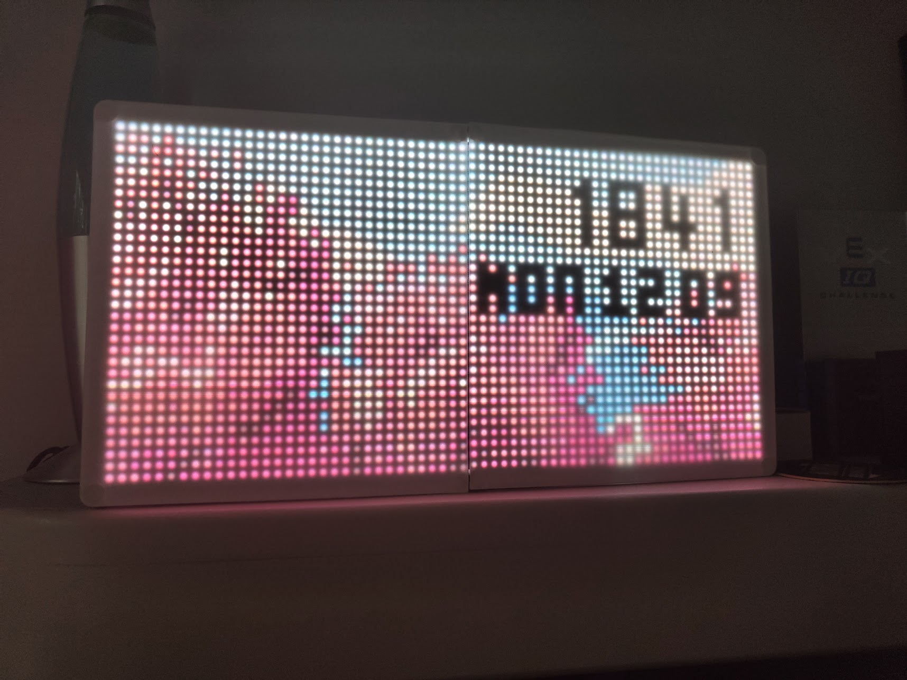
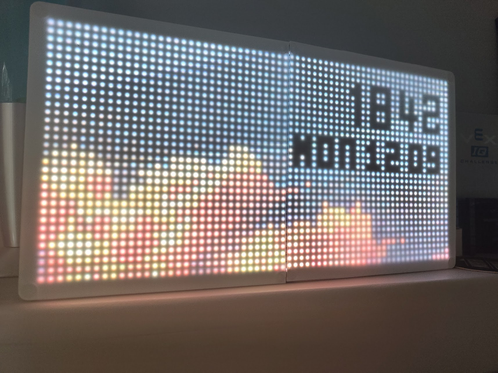
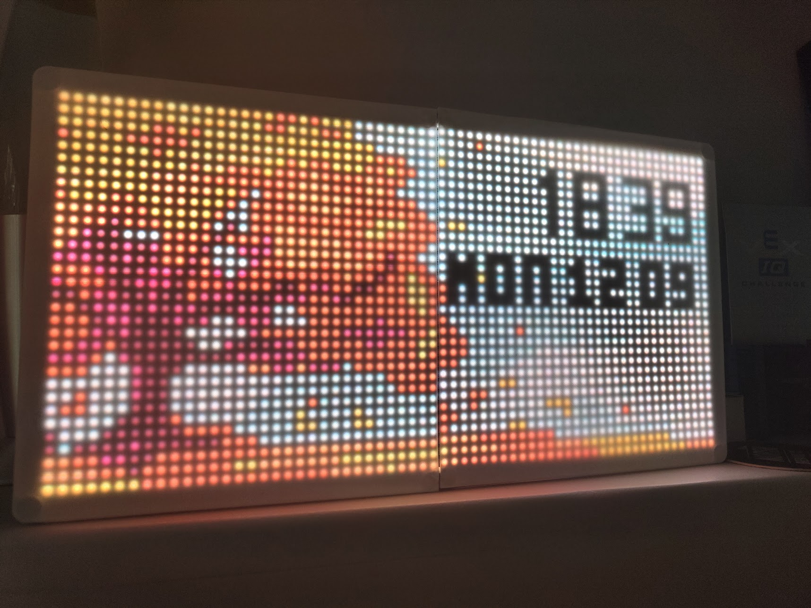
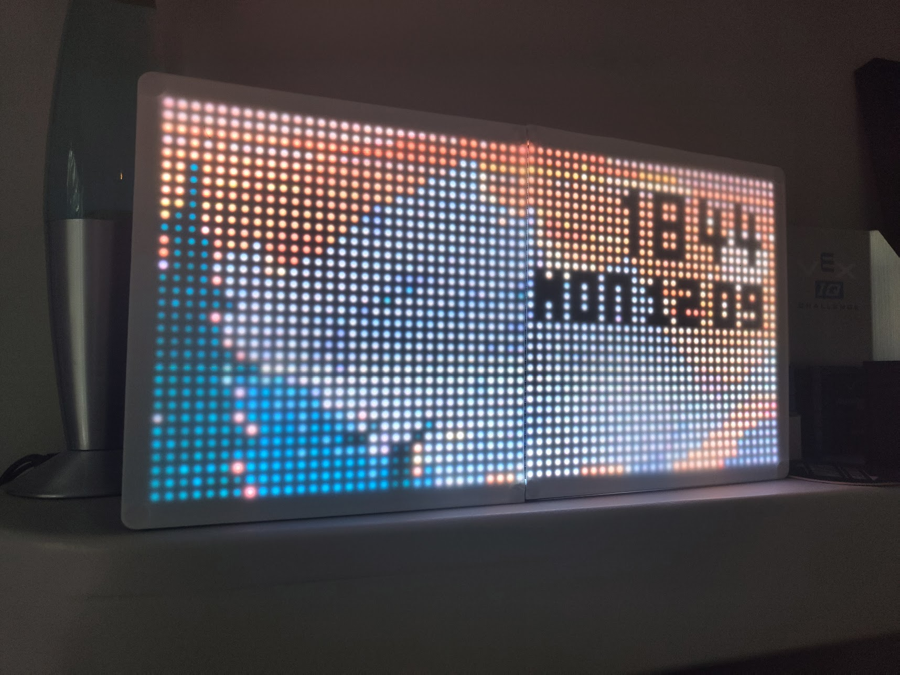
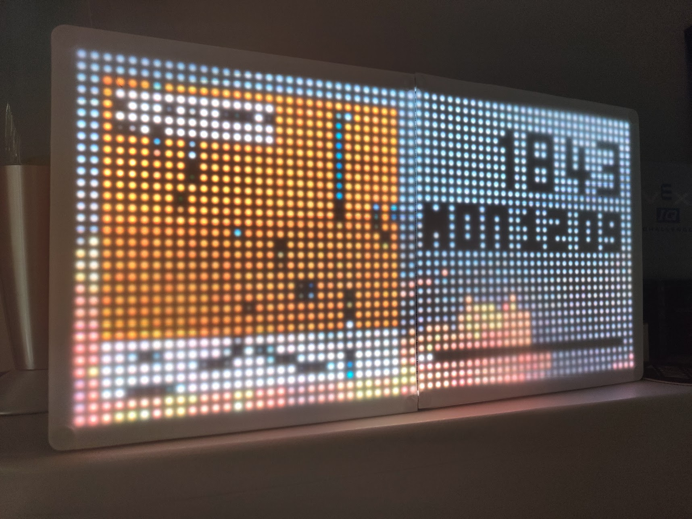

# LED-Manager

This is the codebase for a personal project of mine - a 64x32 LED Matrix display powered using a raspberry pi with an adafruit hat to control the matrices (it's actually two 32x32).
It might be useful if you're looking to build something similar, though the code is very much not intended to be run by anyone else.
The case/display panels are designed and 3D printed by me - CAD files are included in the cad folder in the repo.

Features:
 - Seasonal Changing Background
 - Spotify Currently playing album and progress bar
 - Phillips Hue Integration
 - Configurable via local web interface
 - Auto-dimming according to sunset time and status of phillips bulbs
 - Bonus features suck as strobe, rainbow effects and the ability to display anything sent by another program via POST request.

## Gallery

#### Spring

#### Summer

#### Autumn

#### Winter

#### Music Playing (Summer)

#### Night Mode (Autumn)

#### Web Interface

